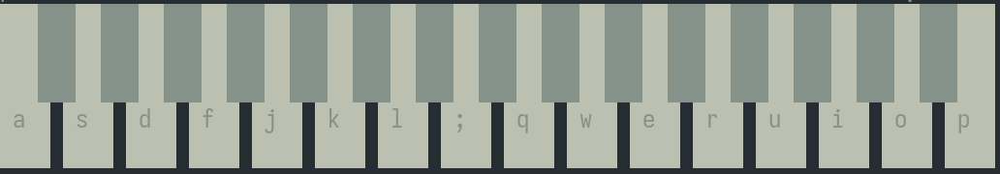

# Piano

Play music from the command line



## Customization and user guide
I give you 89 piano key sounds in `./piano_sounds` from
[here](https://github.com/fuhton/piano-mp3). You can use whatever audio file you
want, in all the formats supported by `miniaudio.h`. You can edit `./config.h`
as in the example, the first pair is the left piano key and the last one is the
most right key. 

You have to compile it every time you modify configuration. Once the program is
running, you have to press `ESC` to exit. 

Example:
```c 
#define DIR "piano_sounds/"
KEY('a', "C4.mp3")
KEY('b', "D4.mp3")
```
Here the key `a` is associated with the sound `C4.mp3`. This sound is in
`piano_sounds/`.
